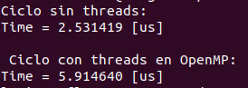

# ELO 321 (Sistemas Operativos) 2020 S2
Integrantes: Luciano Flores Castillo 201621023-7 luciano.flores@sansano.usm.cl
Cristian Herrera Leizgold 201621049-0 cristian.herreral@sansano.usm.cl

## Tarea 2: Manejo de hilos

En esta tarea se exploran y evalúan distintas herramientas para generar hilos para una tarea, y además se comparan con la versión del mismo programa sin hilos. La tarea a efectuar es *checkear* la validez de un tablero de sudoku dado.

### Para compilar...

```C
    gcc -o tarea2_exec -fopenmp main.c sudokuUtils.h
```

### Para correr

```C
    ./tarea2_exec numero_iteraciones
```
- El numero de iteraciones es para repetir varias veces cada implementación (con o sin hilos) y así calcular un promedio para tener un dato más representativo del conjunto
- Si no se elige un numero de iteraciones será 10000 por defecto

### Demostraciones



<br/>

